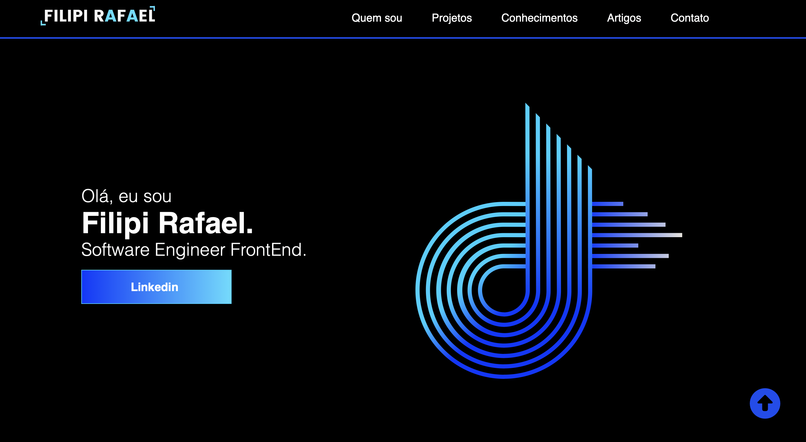

# Website pessoal para projetos/portfólio

## Sobre o Projeto
A ideia do projeto foi para aplicar, práticar e melhorar minhas habilidades técnicas em desenvolvimento web. Além de utilizar no meu domínio público para fins de portfólio e apresentação profissional.

- [Acesse meu site - Produção](https://filipirafael.com)

**Acesse o github pages (Versão de Homologação)**: https://filipirafael.github.io/website-portfolio-2022/

## Novas versões
Conforme vou adquirindo novas habilidades, irei atualizando o projeto em novas versões. 

    

